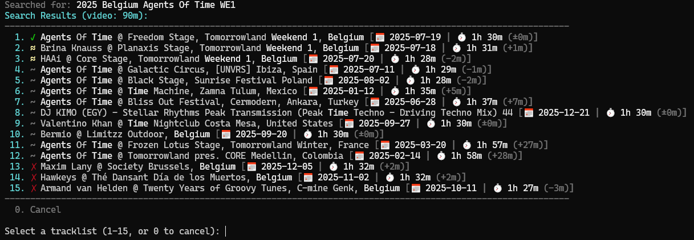

# Add-TracklistChapters

[](#changelog)

Automatically add chapter markers to video files using tracklists from [1001Tracklists.com](https://www.1001tracklists.com).

Navigate DJ sets, live recordings, and music mixes track by track.



## Features

- 🔍 **Smart Search** - Search 1001Tracklists.com directly from the command line
- 📁 **Filename Detection** - Automatically derives search query from video filename
- 🎯 **Intelligent Relevance Scoring** - Results ranked by duration match, keywords, abbreviations, event patterns, year, and recency
- 🔤 **Abbreviation Matching** - Recognizes event abbreviations (e.g., `AMF` matches "Amsterdam Music Festival")
- 📅 **Event Pattern Detection** - Understands multi-day event notation (`WE1`, `WE2`, `Day1`, `D2`, etc.)
- 🌍 **Accent-Insensitive Matching** - `Chateau` matches `Château`, `Ibanez` matches `Ibañez`
- 🎬 **YouTube ID Stripping** - Automatically removes yt-dlp video IDs from filenames (e.g., `[dQw4w9WgXcQ]`)
- ⚡ **Fast In-Place Editing** - Uses `mkvpropedit` for near-instant chapter embedding (no remuxing)
- 🍪 **Session Caching** - Login cookies cached for ~100 days for faster consecutive runs
- 🔄 **Duplicate Detection** - Skips files that already have identical chapters
- 🔗 **URL Storage** - Stores tracklist URL in file for instant reuse on subsequent runs
- 🕐 **Future Timestamp Pickup** - Tags files with tracklist URL even when timestamps aren't available yet
- 📦 **Pipeline Support** - Batch process multiple files via PowerShell pipeline
- ⏭️ **Auto-Select Mode** - Fully automated chapter embedding for batch processing
- 🛡️ **Rate Limit Protection** - Configurable delay between requests, automatic retry with backoff on rate limits
- ✅ **WhatIf/Confirm Support** - Standard PowerShell `-WhatIf` and `-Confirm` support for safe operation

## Requirements

- PowerShell 5.1+ (Windows) or PowerShell Core 7+ (cross-platform)
- [MKVToolNix](https://mkvtoolnix.download/) installed (provides `mkvmerge`, `mkvextract`, and `mkvpropedit`)
- 1001Tracklists.com account (free, required for search functionality)

## Installation

1. Download `Add-TracklistChapters.ps1`
2. Create configuration files:
   ```powershell
   .\Add-TracklistChapters.ps1 -CreateConfig
   ```
3. Edit `config.json` in the script directory:
   ```json
   {
     "Email": "your-email@example.com",
     "Password": "your-password",
     "ChapterLanguage": "eng",
     "MkvMergePath": "",
     "ReplaceOriginal": false,
     "NoDurationFilter": false,
     "AutoSelect": false,
     "DelaySeconds": 5
   }
   ```
4. Optionally edit `aliases.json` to add custom event abbreviations (see [Event Aliases](#event-aliases)).

## Usage

### Basic Usage (Search from Filename)

Simply provide a video file - the script will search using the filename:

```powershell
.\Add-TracklistChapters.ps1 -InputFile "2025 - AMF - Sub Zero Project.webm"
```

This searches for "2025 AMF Sub Zero Project" and presents matching tracklists for selection.

### Process a Folder

Point directly at a folder to process all MKV/WEBM files in it:

```powershell
# Top-level files only
.\Add-TracklistChapters.ps1 -InputFile "D:\DJ Sets" -AutoSelect -ReplaceOriginal

# Include subfolders
.\Add-TracklistChapters.ps1 -InputFile "D:\DJ Sets" -Recurse -AutoSelect -ReplaceOriginal

# Mix folders and files
.\Add-TracklistChapters.ps1 "D:\Ultra", "D:\EDC", "special-set.mkv" -AutoSelect
```

### Automated Mode

Use `-AutoSelect` to automatically pick the best match:

```powershell
.\Add-TracklistChapters.ps1 -InputFile "video.mkv" -AutoSelect
```

### Custom Search Query

```powershell
.\Add-TracklistChapters.ps1 -InputFile "video.mkv" -Tracklist "Hardwell Ultra Miami 2024"
```

### Direct URL or ID

```powershell
# Using URL
.\Add-TracklistChapters.ps1 -InputFile "video.mkv" -Tracklist "https://www.1001tracklists.com/tracklist/1g6g22ut/..."

# Using tracklist ID
.\Add-TracklistChapters.ps1 -InputFile "video.mkv" -Tracklist "1g6g22ut"
```

### Local Tracklist File

```powershell
.\Add-TracklistChapters.ps1 -InputFile "video.mkv" -TrackListFile "chapters.txt"
```

Tracklist file format:
```
[00:00] Artist - Track Title
[03:45] Another Artist - Another Track
[1:07:30] Third Artist - Third Track
```

### From Clipboard

Copy a tracklist from your browser, then:

```powershell
.\Add-TracklistChapters.ps1 -InputFile "video.mkv" -FromClipboard
```

### Preview Mode

See what chapters would be added without modifying the file:

```powershell
.\Add-TracklistChapters.ps1 -InputFile "video.mkv" -Preview
```

### Replace Original File

```powershell
.\Add-TracklistChapters.ps1 -InputFile "video.mkv" -ReplaceOriginal
```

## Batch Processing

The script supports pipeline input for processing multiple files:

```powershell
# Process all MKV files with auto-select
Get-ChildItem "D:\DJ Sets\*.mkv" | .\Add-TracklistChapters.ps1 -AutoSelect -ReplaceOriginal

# Process all WEBM files recursively
Get-ChildItem "D:\Videos\*.webm" -Recurse | .\Add-TracklistChapters.ps1 -AutoSelect -ReplaceOriginal

# Preview chapters for all files without modifying
Get-ChildItem "*.webm" | .\Add-TracklistChapters.ps1 -Preview
```

A delay is automatically added between files to avoid rate limiting (default: 5 seconds). You can adjust this:

```powershell
# Faster processing (may trigger rate limits)
Get-ChildItem "*.mkv" | .\Add-TracklistChapters.ps1 -AutoSelect -DelaySeconds 2

# More conservative delay
Get-ChildItem "*.mkv" | .\Add-TracklistChapters.ps1 -AutoSelect -DelaySeconds 10
```

A summary is displayed after batch processing:

```
--------------------------------------------------
Summary: 12 files processed
  7 chapters added
  2 already up-to-date
  2 tagged (awaiting timestamps)
  1 skipped
```

## Search Algorithm

The script uses intelligent relevance scoring to find the best matching tracklist. Use `-Verbose` to see the scoring breakdown for each result.

### Scoring Factors

The scoring uses a **multiplicative approach**: content relevance (keywords, abbreviations, etc.) is the primary signal, and duration acts as a multiplier that amplifies good matches. This prevents duration-only matches from outranking content-relevant results (e.g., a random set with matching duration beating the correct artist/event).

**Content score** (multiplied by duration):

| Factor | Points | Description |
|--------|--------|-------------|
| **Keywords** | 0 to 120 | Proportional to matched keywords (max 100), +20 bonus if all match |
| **Abbreviations** | +35 each | `AMF` → "Amsterdam Music Festival", `EDC` → "Electric Daisy Carnival" |
| **Aliases** | +35 each | Matches from aliases.json (case-insensitive), e.g., `tml` → "Tomorrowland" |
| **Event Patterns** | -30 to +40 | Correct pattern = +40, wrong pattern = -30 |

**Duration multiplier** (applied to content score):

| Difference | Multiplier | Meaning |
|------------|------------|---------|
| ±1 min | 2.0x | Exact match — almost certainly the same recording |
| ±5 min | 1.8x | Close match — likely same recording |
| ±15 min | 1.4x | Moderate — possibly edited or partial |
| ±30 min | 1.1x | Significant — unlikely same recording |
| >30 min | 0.8x | Very different — reduces score |

**Additive bonuses** (not multiplied):

| Factor | Points | Description |
|--------|--------|-------------|
| **Year** | +25 | Matches year in query to tracklist date |
| **Recency** | 0 to 10 | Minor tiebreaker favoring newer tracklists |

### Result Filtering

Results with 0 keyword matches are always filtered out (these are pure noise from duration/year matching).

Additionally, when an event is specified (via alias or abbreviation), results with only 1 keyword match and no event match are filtered out. This removes false positives like "House Party 133" matching "Swedish House Mafia".

### Smart Query Parsing

The script automatically handles common filename patterns:

- **YouTube IDs**: `Video Title [dQw4w9WgXcQ]` → stripped automatically
- **Accented characters**: `Tiësto` and `Tiesto` both match, `Château` matches `Chateau`
- **Event patterns**: `WE2`, `W2`, `Weekend2` all recognized as "Weekend 2" and count as matched keywords
- **Abbreviations**: Uppercase words like `AMF`, `EDC`, `ASOT` matched against full event names
- **Aliases**: Any word matching a key in aliases.json (case-insensitive) boosts results containing the target event name

### Examples

**Event pattern matching (WE1 → Weekend 1):**
```
Query: "2025 - TML Belgium - Hardwell WE1"
QueryParts: Year=2025, Keywords=[tml, belgium, hardwell, we1], Aliases=[TML->Tomorrowland], EventPatterns=[Weekend1]

Score 355.1 for 'Hardwell @ Mainstage, Tomorrowland Weekend 1, Belgium...'
      [Dur:x2.0(1m diff) | Alias:35(TML->Tomorrowland) | Kw:120(4/4) | Pat:40 | Year:25 | Rec:5.1]

Score 185.9 for 'Hardwell @ Mainstage, Tomorrowland Weekend 2, Belgium...'
      [Dur:x2.0(1m diff) | Alias:35(TML->Tomorrowland) | Kw:75(3/4) | Pat:-30 | Year:25 | Rec:5.9]  ← Wrong weekend, penalized
```

**Abbreviation matching (AMF, EDC):**
```
Query: "2025 AMF KI/KI B2B Armin van Buuren"
QueryParts: Year=2025, Keywords=[amf, ki/ki, b2b, armin, van, buuren], Abbreviations=[AMF]

Score 226.2 for 'Armin van Buuren & KI/KI @ Two Is One, Amsterdam Music Festival...'
      [Dur:x1.8(4m diff) | Abbr:35(AMF=AMF) | Kw:66.7(4/6) | Year:25 | Rec:4.2]  ← AMF matched

Score 179.8 for 'Armin van Buuren - Piano...'
      [Dur:x1.8(5m diff) | Abbr:0 | Kw:50(3/6) | Year:25 | Rec:6.8]               ← No abbreviation match
```

**YouTube ID stripping:**
```
Query: "Marlon Hoffstadt Live at EDC Las Vegas 2025 [JX2STP6HL5k]"
       → YouTube ID stripped, EDC detected as abbreviation

Score 171.4 for 'Marlon Hoffstadt @ kineticFIELD, EDC Las Vegas...'
      [Dur:x2.0(0m diff) | Abbr:35(EDC(direct)) | Kw:63.6(7/11) | Rec:5]
```

**Accent-insensitive matching:**
```
Query: "Tiësto - Dreamstate 2025 (Full Set)"
       → Tiësto normalized for matching

Score 134.9 for 'Tiësto @ The Dream Stage, Dreamstate SoCal...'
      [Dur:x2.0(0m diff) | Kw:50(2/4) | Year:25 | Rec:9.9]
```

**Alias matching (lowercase/unofficial abbreviations):**
```
Query: "armin van buuren - asot 2025 - utrecht"
       → asot matched via aliases.json to "A State of Trance"

Score 199.5 for 'Armin van Buuren @ A State of Trance 1000, Utrecht...'
      [Dur:x2.0(0m diff) | Alias:35(asot->A State of Trance) | Kw:66.7(4/6) | Year:25 | Rec:4.5]
```

### Score Interpretation

| Score Range | Meaning |
|-------------|---------|
| 250+ | Excellent match - likely the exact recording |
| 150-250 | Good match - probably correct |
| 80-150 | Partial match - review manually |
| <80 | Poor match - likely wrong tracklist |

## Search Results Display

**Artist with abbreviation matching (AMF → Amsterdam Music Festival):**
```
Search Results (video: 47m):
--------------------------------------------------------------------------------------------------------------
  1. ✓ Armin van Buuren & KI/KI @ Two Is One, Amsterdam Music Festival [📅 2025-10-25 | ⏱️ 51m (+4m)]
  2. ≈ Armin van Buuren - Piano [📅 2025-11-10 | ⏱️ 52m (+5m)]
  3. ≈ Armin van Buuren @ SLAM! (Amsterdam Dance Event, Netherlands) [📅 2025-10-22 | ⏱️ 51m (+4m)]
  4. ~ Armin van Buuren @ Mainstage, Tomorrowland Brasil [📅 2025-10-10 | ⏱️ 58m (+11m)]
  5. ~ Armin van Buuren @ Amsterdam Music Festival, Netherlands [📅 2025-10-25 | ⏱️ 1h 24m (+37m)]
--------------------------------------------------------------------------------------------------------------
```

**B2B set with many keywords (Martin Garrix B2B Alesso @ Red Rocks):**
```
Search Results (video: 60m):
--------------------------------------------------------------------------------------------------------------
  1. ✓ Martin Garrix & Alesso @ Red Rocks Amphitheatre, United States [📅 2025-10-24 | ⏱️ 1h (±0m)]
  2. ≈ Martin Garrix @ Red Rocks Amphitheatre, United States [📅 2025-10-23 | ⏱️ 1h 59m (+59m)]
  3. ≈ Alesso @ Red Rocks Amphitheatre, United States [📅 2025-10-24 | ⏱️ 1h 2m (+2m)]
--------------------------------------------------------------------------------------------------------------
```

**YouTube filename with accent (Tiësto - Live at We Belong Here Miami 2026):**
```
Search Results (video: 126m):
--------------------------------------------------------------------------------------------------------------
  1. ~ Tiësto @ We Belong Here, Historic Virginia Key Park [📅 2026-03-01 | ⏱️ 3h (+54m)]
  2. ~ MOGUAI & Tiësto & MARTEN HØRGER - 1LIVE DJ Session [📅 2026-01-31 | ⏱️ 2h 58m (+52m)]
  3. ~ Tiësto @ Dome SVP Stadium, India [📅 2026-01-23 | ⏱️ 2h 19m (+13m)]
--------------------------------------------------------------------------------------------------------------
```

**Festival set with event alias (Oliver Heldens at Mysteryland):**
```
Search Results (video: 89m):
--------------------------------------------------------------------------------------------------------------
  1. ✓ Oliver Heldens @ Mainstage, Mysteryland, Netherlands [📅 2025-08-23 | ⏱️ 1h 29m (±0m)]
  2. ≈ Oliver Heldens @ Mainstage, Tomorrowland Weekend 1, Belgium [📅 2025-07-18 | ⏱️ 1h (-29m)]
  3. ~ Oliver Heldens @ Orangerie, Tomorrowland Weekend 2, Belgium [📅 2025-07-26 | ⏱️ 1h 58m (+29m)]
--------------------------------------------------------------------------------------------------------------
```

**EDC set with long filename (Tiësto - In Search Of Sunrise live set at EDC Las Vegas):**
```
Search Results (video: 77m):
--------------------------------------------------------------------------------------------------------------
  1. ✓ Tiësto @ In Search Of Sunrise, kineticFIELD, EDC Las Vegas [📅 2025-05-18 | ⏱️ 1h 17m (±0m)]
  2. ≈ Tiësto @ kineticFIELD, EDC Las Vegas, United States [📅 2025-05-17 | ⏱️ 1h 13m (-4m)]
  3. ~ GORDO @ bassPOD, EDC Las Vegas, United States [📅 2025-05-16 | ⏱️ 1h 7m (-10m)]
--------------------------------------------------------------------------------------------------------------
```

**Result quality indicators** (based on overall relevance score):
- ✓ (green) - Excellent match (score 250+)
- ≈ (yellow) - Good match (score 150-250)
- ~ (dim) - Partial match (score 80-150)
- ✗ (red) - Poor match (score <80)

Duration difference is shown as `(±0m)`, `(+Xm)`, or `(-Xm)` relative to the video file.

## Parameters

| Parameter | Description |
|-----------|-------------|
| `-InputFile` | One or more MKV/WEBM files or folders to process. Accepts pipeline input. |
| `-Tracklist` | Search query, URL, or tracklist ID |
| `-TrackListFile` | Local text file with timestamps |
| `-FromClipboard` | Read tracklist from clipboard |
| `-AutoSelect` | Automatically select the top result |
| `-DelaySeconds` | Delay between files in pipeline mode (default: 5, range: 0-60) |
| `-NoDurationFilter` | Disable duration-based result filtering |
| `-Preview` | Show chapters without modifying file (alias for `-WhatIf`) |
| `-WhatIf` | Show what would happen without making changes |
| `-Confirm` | Prompt for confirmation before modifying each file |
| `-IgnoreStoredUrl` | Force fresh search, ignoring any stored tracklist URL |
| `-Recurse` | When InputFile is a folder, include subfolders |
| `-ReplaceOriginal` | Replace original file instead of creating new |
| `-OutputFile` | Custom output filename |
| `-ChapterLanguage` | Chapter language code (default: `eng`) |
| `-MkvMergePath` | Custom path to MKVToolNix directory |
| `-Email` | 1001Tracklists.com email (overrides config) |
| `-Password` | 1001Tracklists.com password (overrides config) |
| `-Credential` | PSCredential object (alternative to Email/Password) |
| `-CreateConfig` | Generate or update config.json and aliases.json files |
| `-Verbose` | Show detailed scoring breakdown and debug info |

## Configuration

The `config.json` file supports the following options:

```json
{
  "Email": "",
  "Password": "",
  "ChapterLanguage": "eng",
  "MkvMergePath": "",
  "ReplaceOriginal": false,
  "NoDurationFilter": false,
  "AutoSelect": false,
  "DelaySeconds": 5
}
```

Command-line parameters always override config file values.

### Updating Configuration

Running `-CreateConfig` is non-destructive - it merges new default settings with your existing configuration:

```powershell
.\Add-TracklistChapters.ps1 -CreateConfig
```

Output:
```
config.json: Updated (added: AutoSelect, DelaySeconds)
aliases.json: Unchanged (already up to date)
```

Your existing credentials and settings are preserved while new options are added.

## Event Aliases

The `aliases.json` file maps event abbreviations to their full names for improved search matching. This helps when:
- Using lowercase abbreviations in filenames (e.g., `asot` instead of `ASOT`)
- Using unofficial abbreviations that can't be dynamically detected (e.g., `TML` for Tomorrowland)

```json
{
  "AMF": "Amsterdam Music Festival",
  "ADE": "Amsterdam Dance Event",
  "EDC": "Electric Daisy Carnival",
  "UMF": "Ultra Music Festival",
  "ASOT": "A State of Trance",
  "ABGT": "Above & Beyond Group Therapy",
  "WAO138": "Who's Afraid of 138",
  "FSOE": "Future Sound of Egypt",
  "GDJB": "Global DJ Broadcast",
  "SW4": "South West Four",
  "TML": "Tomorrowland",
  "TL": "Tomorrowland",
  "DWP": "Djakarta Warehouse Project",
  "MMW": "Miami Music Week"
}
```

Alias matching is case-insensitive. When a filename contains an alias key (e.g., `asot`), results containing the target name (e.g., "A State of Trance") receive a +35 score boost.

Add your own abbreviations for regional events or personal naming conventions.

## Behavior Notes

### Fast In-Place Editing

The script uses `mkvpropedit` to modify chapters and tags directly in the file without remuxing. This makes chapter embedding nearly instantaneous regardless of file size:

| File Size | Time |
|-----------|------|
| 1 GB | < 1 second |
| 10 GB | < 1 second |
| 50 GB | < 1 second |

When not using `-ReplaceOriginal`, the file is first copied to the output location, then modified in place.

### Session Caching

Login cookies are cached in `.1001tl-cookies.json` in the script directory. This speeds up consecutive runs by avoiding repeated logins. Cache is valid until cookies expire (~100 days).

### Rate Limit Protection

1001Tracklists.com has rate limits to prevent abuse. The script includes several protections:

- **Automatic delay**: A configurable delay (default: 5 seconds) is added between files in pipeline mode
- **Detection**: Both HTTP 429 status codes and rate limit page content are detected
- **Auto-retry**: When rate limited, the script waits 30 seconds and retries once before giving up
- **Session preservation**: Rate limits don't invalidate your session — cookies are preserved for the retry

If the auto-retry fails:
1. Visit 1001Tracklists.com in your browser
2. Solve the captcha
3. Re-run the script (your existing session will still work)

### Duplicate Chapter Detection

Before modifying, the script extracts existing chapters using `mkvextract` and compares them with the new chapters. If they're identical **and** the tracklist URL is already stored, the file is skipped:
```
Chapters already exist and are identical - skipping.
```

If chapters are identical but no URL is stored yet (e.g., files processed before this feature), the file will be updated to add the URL:
```
Chapters identical, but adding tracklist URL to file...
```

### Tracklist URL Storage

When chapters are added from 1001Tracklists.com, the tracklist URL and title are stored as MKV global tags in the output file. URLs are stored in short format (e.g., `https://www.1001tracklists.com/tracklist/2ft171s9/`).

On subsequent runs:

- **Interactive mode**: Prompts with the stored tracklist info:
  ```
  Found stored tracklist:
    Martin Garrix @ Mainstage, Tomorrowland Weekend 2, Belgium 2025
    https://www.1001tracklists.com/tracklist/2ft171s9/

    Y = Use this tracklist  |  S = Skip file  |  R = Retry search
  Use this tracklist? (Y/s/r)
  ```
  Press Enter or `Y` to reuse, `S` to skip the file, or `R` to start a new search.

- **AutoSelect mode**: Uses the stored URL directly without searching, significantly speeding up batch re-processing.

Use `-IgnoreStoredUrl` to force a fresh search even when a stored URL exists.

### Tracklists Without Timestamps

Some tracklists on 1001Tracklists.com don't have timestamps yet - timestamps are added by the community over time. When you select a tracklist without timestamps, the script stores the tracklist URL in the file so it can automatically pick up the timestamps on a future run.

**Interactive mode** prompts for action:
```
This tracklist has no timestamps yet. Timestamps are added by users on 1001Tracklists.com.

  T = Tag only (check again later)  |  R = Retry search  |  S = Skip
Action? (T/r/s)
```
Press Enter or `T` to tag the file for future pickup, `R` to search for a different tracklist, or `S` to skip.

**AutoSelect mode** automatically tags the file:
```
No timestamps yet - tagging for future pickup.
Tagging file...
Tagged for future timestamp pickup: video.mkv
```

**On subsequent runs**, if the tracklist now has timestamps, chapters are added automatically. If timestamps are still unavailable:
```
Already tagged, awaiting community timestamps.
```
The file is skipped since it's already tagged with the same URL.

This workflow allows you to batch-process files immediately when tracklists are published, then re-run later to pick up timestamps as the community adds them.

### Filename to Query Conversion

When using filename-based search, the script:
1. Removes the file extension
2. Removes YouTube video IDs (11-character codes in brackets at the end)
3. Replaces `-`, `_`, `.` with spaces
4. Normalizes multiple spaces

## Troubleshooting

**"No tracklists found"**
- Try a different search query
- Use `-NoDurationFilter` to see all results regardless of duration
- Check if the tracklist exists on 1001Tracklists.com

**"Rate limited by 1001Tracklists"**
- The script automatically retries once after a 30-second wait
- If the retry also fails, visit 1001Tracklists.com in your browser and solve the captcha
- Re-run the script (your session cookies are preserved)
- Consider increasing `-DelaySeconds` for batch processing

**"This tracklist has no timestamps yet"**
- The tracklist exists but timestamps haven't been added by users yet
- Choose `T` to tag the file now and re-run later when timestamps are available
- Or choose `R` to search for a different tracklist that has timestamps
- In `-AutoSelect` mode, files are automatically tagged for future pickup

**"Already tagged, awaiting community timestamps"**
- The file was previously tagged with a tracklist URL that still has no timestamps
- Re-run the script later when the community has added timestamps
- Use `-IgnoreStoredUrl` to search for a different tracklist

**"Chapters already exist and are identical - skipping"**
- The file already has the same chapters - no action needed
- Use a different tracklist if you want different chapters

**mkvmerge/mkvpropedit not found**
- Install [MKVToolNix](https://mkvtoolnix.download/)
- Or specify the path: `-MkvMergePath "C:\Program Files\MKVToolNix\mkvmerge.exe"`

**Wrong tracklist selected in AutoSelect mode**
- Use `-Verbose` to see scoring breakdown
- Try adding more specific keywords to the filename or `-Tracklist` parameter
- Include the year, event abbreviation, or weekend/day number for better matching

**Cookie/session errors**
- Delete `.1001tl-cookies.json` in the script directory to force a fresh login

## Changelog

See [CHANGELOG.md](CHANGELOG.md) for a detailed history of changes.